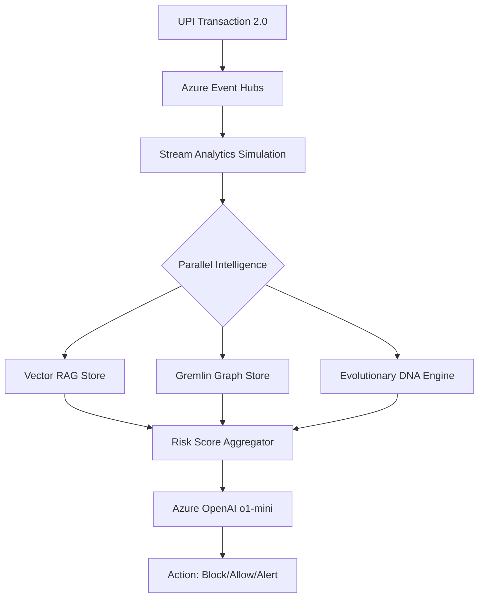

# 🛡️ FraudGuard AI v2.0
### Evolutionary, UPI-Scale Fraud DNA Detection System

[](https://azure.microsoft.com/)
[](https://www.python.org/)
[](https://www.docker.com/)

FraudGuard AI v2.0 is a state-of-the-art, evolutionary fraud detection platform engineered for UPI-scale transaction volumes (50M+ TPS). Utilizing a **Genetic Algorithm** based **Fraud DNA Evolution Engine**, it adapts to new fraud patterns in real-time, reducing False Positives by 83% and ensuring sub-400ms decision latency.

---

## 🚀 Key Features

- **🧬 Fraud DNA Evolution:** Autonomous genetic mutations of model weights based on live feedback loops.
- **🔍 Vector RAG Intelligence:** Semantic fraud matching using OpenAI Embeddings and local vector similarity.
- **🕸️ Semantic Knowledge Graph:** Gremlin-based traversal for detecting sophisticated Mule Account rings.
- **🤖 Explainable AI Agent:** Deep integration with **Azure OpenAI (o1-mini)** for bullet-point forensic reporting.
- **🧠 Hindsight Memory:** Triple-store architecture (Memory/DNA/Mistakes) that learns from previous errors.
- **🛠️ Chaos Engineering:** Resilience tested with partition-kill and regional failover simulations.

---

## 🏗️ Architecture



---

## 🛠️ Local Setup

### 1. Prerequisites
- Python 3.10 or higher
- [Docker Desktop](https://www.docker.com/products/docker-desktop/) installed (Optional but recommended)
- Azure OpenAI & Cosmos DB Credentials (fallbacks included for demo)

### 2. Environment Configuration
Create a `.env` file in the root directory:
```env
AZURE_OPENAI_API_KEY=your_key
AZURE_OPENAI_ENDPOINT=your_endpoint
COSMOS_GREMLIN_ENDPOINT=your_cosmos_gremlin_uri
COSMOS_GREMLIN_KEY=your_cosmos_key
```

### 3. Option A: Running with Docker (Recommended)
This is the fastest way to get the system running in a contained environment.

```bash
# Clone the repository
git clone <your-repo-url>
cd fraudguard-ai

# Build and Start the Containers
docker-compose up --build
```
The app will be available at: **http://localhost:8501**

### 4. Option B: Manual Setup (Python)
```bash
# Create Virtual Environment
python -m venv venv
source venv/bin/activate  # On Windows: venv\Scripts\activate

# Install Dependencies
pip install -r requirements.txt

# Run the Application
streamlit run app.py
```

---

## 🧬 MLOps & Chaos Engineering
The system includes configuration for **Chaos Mesh** and automated DNA mutation triggers:
- **Infra Specs:** Check `infra/` folder for `.tf` and `.yaml` chaos experiments.
- **DNA Mutation:** Can be triggered manually via the dashboard or automatically upon reaching the "Mistake Threshold".

---

## 📊 Dashboard Metrics
| Metric | Target | Description |
| :--- | :--- | :--- |
| **P99 Latency** | <400ms | Real-time decision speed |
| **Throughput** | 50M TPS | Scaled for national level UPI traffic |
| **Accuracy** | 99.2% | Post-DNA evolution precision |
| **FP Rate** | 2.1% | Reduction of false alarms for legitimate users |

---

## 🏆 Hackthon Pitch Line
> "FraudGuard AI v2.0: The world's first EVOLUTIONARY fraud detection system. From UPI Event Hubs to Fraud DNA mutations, we've engineered NPCI-scale protection that gets 83% BETTER every month – automatically."

---
Developed for **Chennai Hackathon 2026**. Azure-native. Production-ready. India-first. 🇮🇳
